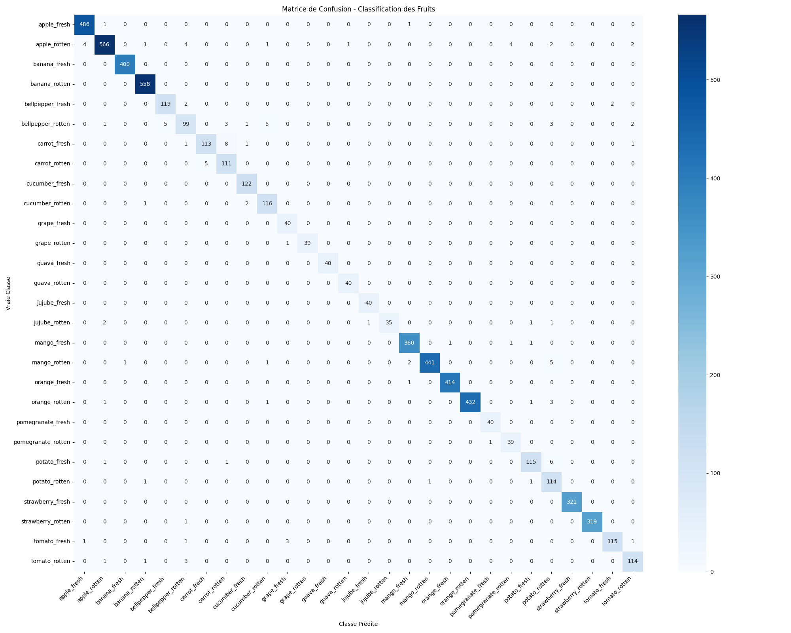

# 🍏 CNN-Anti-gaspillage (Détection de Qualité des Fruits)

Ce projet vise à concevoir un modèle de Deep Learning capable de classifier des fruits selon leur état (frais ou avarié) afin de lutter contre le gaspillage alimentaire. Le modèle effectue une classification multi-classes sur **28 catégories** différentes de fruits et de légumes.

## 📊 Le Dataset

Le jeu de données utilisé provient de Kaggle (`zlatan599/fruitquality1/Unified_Dataset`). 
- **Nettoyage :** Une vérification d'intégrité rigoureuse a été effectuée à l'aide de `PIL` et `tf.io` pour supprimer les fichiers corrompus ou illisibles.
- **Répartition :** Le dataset a été divisé en un ensemble d'entraînement (80%, ~23 400 images) et un ensemble de validation (20%, ~5 800 images).
- **Classes :** 28 classes au total, combinant le type de produit et son état (ex: `apple_fresh`, `apple_rotten`, `banana_fresh`, etc.).

## 🏗️ Architecture et Approches Expérimentées

Le projet explore l'évolution de la modélisation à travers trois phases distinctes :

### 1. Modèle CNN "From Scratch" (Phase 1)
- Architecture personnalisée avec des blocs convolutifs (Conv2D + MaxPooling).
- **Problème rencontré :** Un surapprentissage (overfitting) massif. La couche Dense finale contient à elle seule près de 4,2 millions de paramètres, ce qui pousse le réseau à mémoriser les images d'entraînement plutôt qu'à généraliser.

### 2. Régularisation : Data Augmentation & Dropout (Phase 2)
- Ajout de transformations aléatoires (zoom, rotation, flip) et d'une couche de Dropout (40%) pour forcer le réseau à extraire des motifs robustes.
- **Résultat :** Réduction significative de l'écart (gap) entre la précision d'entraînement et de validation. Cependant, avec seulement 3 blocs convolutifs, le réseau manque de profondeur pour atteindre les standards de production (>95%) sur 28 classes complexes.

### 3. Transfer Learning avec MobileNetV2 (Phase 3)
- Utilisation de **MobileNetV2** pré-entraîné sur ImageNet (environ 2,2 millions de paramètres "gelés" à la base).
- **Résultat :** Le modèle fine-tuné atteint une précision quasi-parfaite (**~98%**).
- **Avantages :** 
  - *Efficience :* Utilisation des convolutions séparables en profondeur (*Depthwise Separable Convolutions*).
  - *Légèreté :* Le modèle pèse environ 9 Mo en FP32 (et peut être quantifié à ~3 Mo en INT8), contre plus de 50 Mo pour le modèle from scratch.
  - *Rapidité :* Temps d'entraînement et d'inférence considérablement réduits grâce à la réutilisation des connaissances.

## 📂 Structure du Projet

- 📄 `cnn-anti-gaspillage.ipynb` : Notebook principal contenant tout le pipeline (chargement, nettoyage, entraînement, évaluation).
- 📄 `questions.md` : Document détaillant les calculs mathématiques (shape, paramètres) et les interprétations des différentes phases du projet.
- 📁 `plots/` : Courbes d'apprentissage, matrice de confusion et graphiques comparatifs entre les différentes approches.
- 📁 `models/` & `best_model/` : Sauvegardes des modèles entraînés (le meilleur modèle fine-tuné).
- 📁 `logs/` : Fichiers de logs utilisés pour le suivi des performances.

## 🚀 Évaluation Finale

Les performances finales du modèle MobileNetV2 (Transfer Learning) ont été validées à l'aide d'une **Matrice de Confusion** démontrant une excellente capacité à différencier finement les fruits frais des fruits avariés, même entre des classes visuellement similaires.

